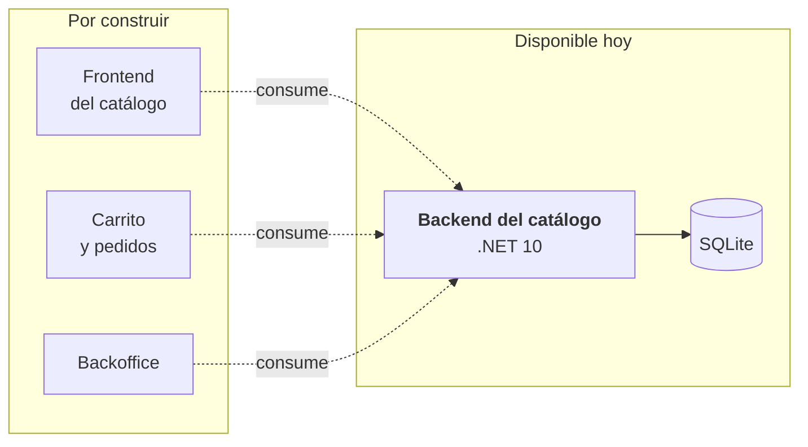
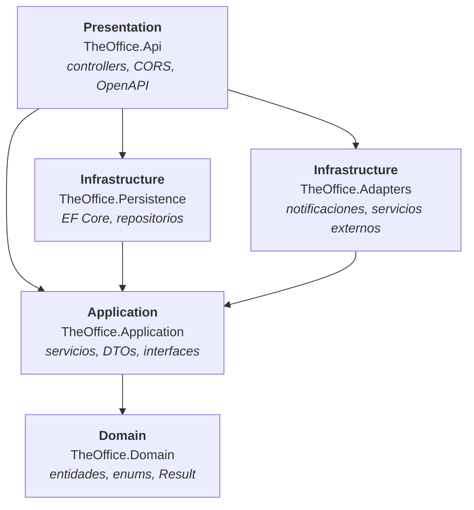
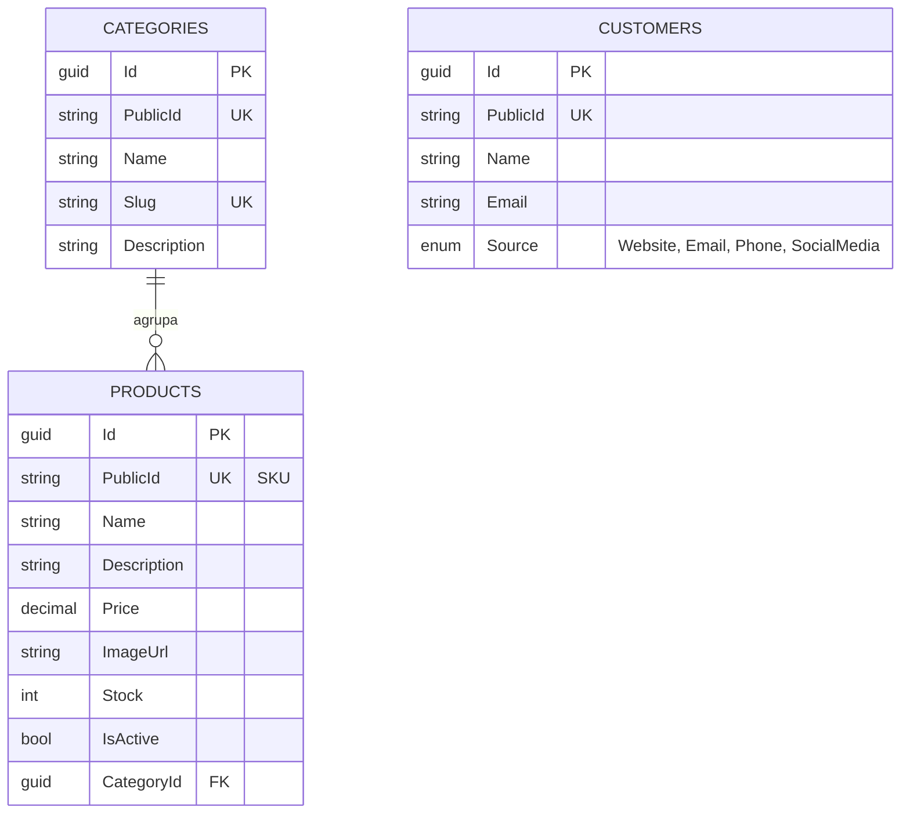

# TheOffice — Ecommerce

**TheOffice** es una tienda en línea de artículos de oficina: papelería, mobiliario, tecnología y organización.

Este repositorio alberga el sistema completo del ecommerce. Hoy contiene únicamente su **primera pieza: el backend del catálogo**; el resto de componentes —frontends, carrito, pedidos y administración— se construyen sobre esa base.

## 🧩 Componentes del sistema

| Componente | Estado | Descripción |
|---|---|---|
| **Backend del catálogo** | ✅ Disponible | API REST de productos, categorías y clientes |
| Frontend del catálogo | 🔜 Por construir | Listado y detalle de producto para el comprador |
| Carrito y pedidos | 🔜 Por construir | Checkout sobre la entidad `Customer` |
| Backoffice | 🔜 Por construir | Administración del catálogo y del inventario |
| Autenticación | 🔜 Por construir | Cuentas de comprador y permisos de escritura |



El backend ya expone CORS configurable por origen, así que los frontends pueden consumirlo desde otro dominio sin cambios adicionales.

---

# Backend del catálogo

Lo disponible hoy en `src/`: una API REST versionada sobre .NET 10, con arquitectura limpia por capas y lista para que crezcan nuevos casos de uso encima.

## ✨ Qué incluye

- **Catálogo de productos:** listado paginado con filtro por categoría y búsqueda por texto, y detalle por SKU.
- **Categorías:** listado para armar la navegación del catálogo.
- **Clientes:** registro y consulta, base para el futuro carrito y los pedidos.
- **API REST versionada** (`/api/v1/...`) documentada con OpenAPI 3.1 y explorable con Scalar.
- **CORS configurable** por origen.
- **Base de datos SQLite** con migraciones de EF Core y datos semilla (16 productos, 4 categorías, 3 clientes).

## 🛠️ Stack

| Componente | Versión |
|---|---|
| .NET | 10 (LTS) |
| Entity Framework Core | 10.0.10 |
| Base de datos | SQLite |
| Versionado de API | Asp.Versioning 10.2.0 |
| Documentación | Microsoft.AspNetCore.OpenApi 10.0.10 + Scalar |

## 🏁 Comenzando

1. Navega a la carpeta `src`.
2. Restaura las dependencias:
   ```bash
   dotnet restore
   ```
3. Ejecuta el backend:
   ```bash
   dotnet run --project Presentation/TheOffice.Api
   ```
4. La API queda en `http://localhost:5226` y la documentación interactiva en `http://localhost:5226/scalar`.

No hace falta preparar la base de datos: en `Development` la aplicación aplica las migraciones al arrancar y siembra el catálogo. El archivo `theoffice.db` se crea local y está ignorado por Git.

Para trabajar las migraciones a mano:

```bash
dotnet ef migrations add <Nombre> -p Infrastructure/TheOffice.Persistence -s Presentation/TheOffice.Api
dotnet ef database update -p Infrastructure/TheOffice.Persistence -s Presentation/TheOffice.Api
```

## 📡 Endpoints

| Método | Ruta | Descripción |
|---|---|---|
| `GET` | `/api/v1/products` | Listado paginado del catálogo |
| `GET` | `/api/v1/products/{publicId}` | Detalle de un producto por SKU |
| `POST` | `/api/v1/products` | Crea un producto |
| `GET` | `/api/v1/categories` | Listado de categorías |
| `GET` | `/api/v1/customers/{publicId}` | Detalle de un cliente |
| `POST` | `/api/v1/customers` | Crea un cliente |

Parámetros de `GET /api/v1/products`:

| Parámetro | Default | Descripción |
|---|---|---|
| `page` | `1` | Página solicitada |
| `pageSize` | `6` | Elementos por página (máximo 50) |
| `category` | — | Filtra por `slug` de categoría |
| `search` | — | Busca en nombre y descripción |

La respuesta del listado trae `items`, `page`, `pageSize`, `totalItems` y `totalPages`. Solo se devuelven productos con `IsActive = true`.

En `src/Presentation/TheOffice.Api/TheOffice.Api.http` hay una petición lista para cada endpoint.

## 🧱 Arquitectura



Las dependencias apuntan hacia adentro: **Domain** no conoce a nadie, **Application** define las interfaces (`IProductRepository`, `INotificationAdapter`) y la **Infrastructure** las implementa. **Presentation** solo orquesta.

### Estructura de carpetas

```
src/
├── Domain/TheOffice.Domain/               Entidades, enums, Result Pattern
├── Application/TheOffice.Application/     Servicios, DTOs, mappers, interfaces
├── Infrastructure/
│   ├── TheOffice.Persistence/             DbContext, modelos, repositorios, migraciones, seeders
│   └── TheOffice.Adapters/                Adaptadores hacia servicios externos
└── Presentation/TheOffice.Api/            Controllers y configuración de la API
```

## 💾 Modelo de datos



Todas las tablas usan un `Id` (UUID) privado y un `PublicId` para las referencias externas, según la decisión 2 de la siguiente sección.

> **Nota sobre `Price` y SQLite:** SQLite guarda `decimal` como TEXT y no soporta comparación ni ordenamiento en SQL, así que ordenar o filtrar por precio fallaría. `Price` se configura con `HasConversion<double>()` en `TheOfficeDbContext`. Es el workaround estándar de EF Core para SQLite y se retira al migrar a SQL Server.

## 🧠 Decisiones de implementación

1. Definimos [DTOs (Data Transfer Objects)](https://www.youtube.com/watch?v=4p6z6hL8BNg) en la capa de **Aplicación** para su uso entre la capa de **Infraestructura** y la capa de **Aplicación**. Esta estrategia nos permite contar con los DTOs necesarios en diferentes capas, facilitando no tener que hacer un mapeo 1:1. Por ejemplo, evitamos tener distintos DTOs para los contratos del **Web API** y la capa de **Aplicación** solo para transferir la información de las solicitudes a los Servicios.

2. Usamos **Public IDs** para las entidades expuestas a consumidores externos. Los IDs que viajan en las solicitudes de productos, categorías o clientes son IDs públicos (`PRD-001`, `CAT-001`, `CUS-001`). Aunque internamente implica un paso adicional para resolver el ID de base de datos, preferimos este enfoque por:

    * **Seguridad:** Los IDs de la base de datos suelen ser secuenciales y predecibles. Exponerlos podría revelar el volumen de los datos o facilitar inferir IDs válidos.
    * **Flexibilidad:** Permiten cambiar la estructura interna de la base de datos sin afectar a los consumidores de la API.
    * **Ofuscación:** Evitan dar una visión directa de la estructura y los patrones de crecimiento de la base de datos.

3. Usamos el **Result Pattern (RP)**, con nuestra propia implementación, para gestionar reglas de negocio, validaciones y operaciones de acceso a datos.

    Ventajas:

    * **Separación de responsabilidades:** Maneja de forma explícita los resultados, separando éxito y error.
    * **Estandarización en el manejo de errores:** En lugar de lanzar excepciones para el control de flujo, devuelve un objeto con la información del error.
    * **Claridad y simplicidad:** Hace explícito si una operación fue exitosa o fallida.
    * **Facilita testing y mantenimiento:** No hay que capturar excepciones inesperadas, se prueban las respuestas esperadas.

    Desventajas: sobrecarga de código, complejidad adicional, adopción en todo el equipo y pérdida del stack trace.

    Alternativas en .NET: [ErrorOr](https://github.com/amantinband/error-or) y [FluentResults](https://github.com/altmann/FluentResults).

4. No agregamos **Async** al nombre de los métodos asíncronos. Es una convención que ya no aporta claridad; la decisión puede variar según tus estándares.

5. Los objetos del **Dominio** no mapean uno a uno con los objetos de persistencia. El dominio contiene únicamente lo necesario para satisfacer las demandas del negocio; la traducción vive en los mappers de cada capa.

---

## 🗺️ Roadmap

Próximos pasos del sistema, en orden aproximado:

1. Frontend del catálogo: listado y detalle de producto.
2. Imágenes múltiples y variantes de producto.
3. Carrito de compras y pedidos.
4. Autenticación y autorización para las operaciones de escritura.
5. Backoffice de administración del catálogo.
6. Validaciones de entrada y manejo centralizado de errores.
7. Pruebas unitarias y de integración.
8. Migración a SQL Server.

## 📄 Licencia

Distribuido bajo licencia MIT. Consulta [license.md](license.md).

La base arquitectónica de este proyecto deriva de la plantilla Clean Architecture .NET de [ManuelZapata.co](https://manuelzapata.co/), también MIT.

© 2026 Arkandia.
