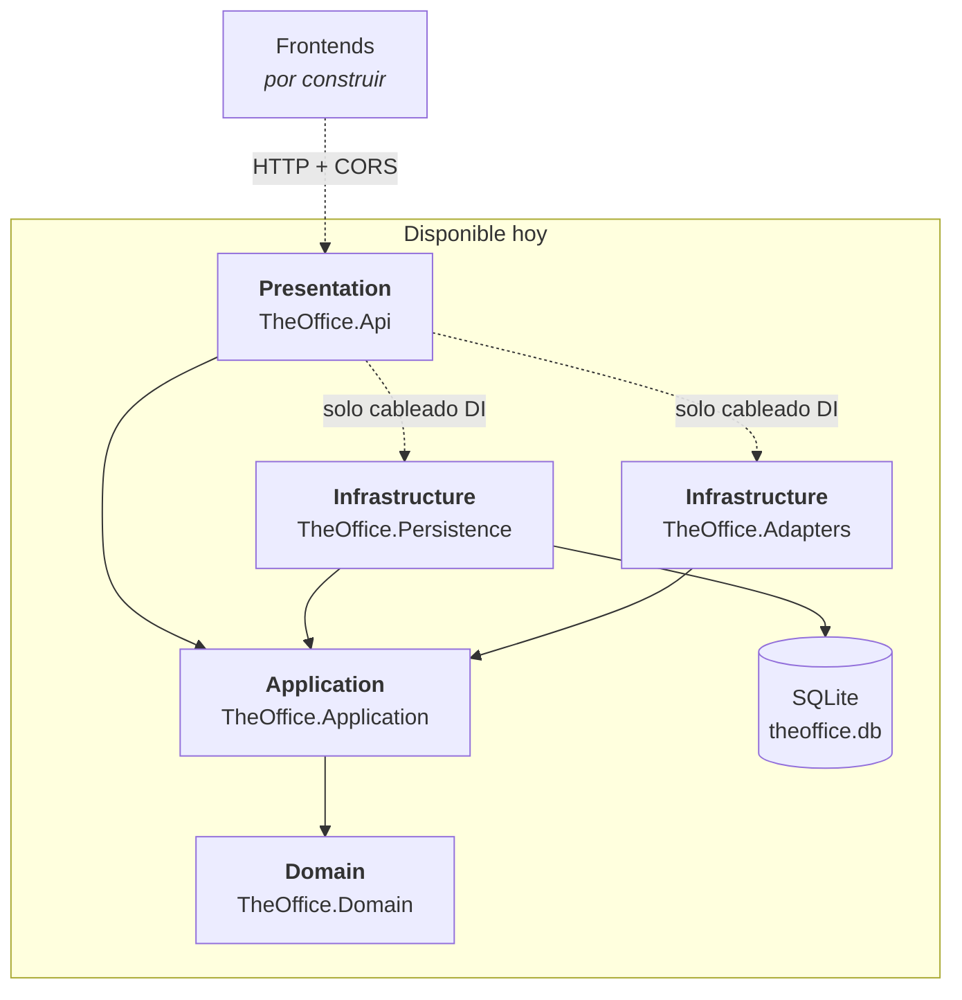

# Arquitectura

## Resumen

ASP.NET Core 10 (controllers) + EF Core 10 sobre SQLite, en una Clean Architecture de cinco
proyectos. Hoy solo existe el **backend del catálogo**: una API REST versionada de productos,
categorías y clientes. Frontend, carrito, pedidos, backoffice y autenticación **no están
construidos** — no asumas que existen. Destino de despliegue aún sin definir.

Para el grafo de proyectos, los TFMs, los paquetes y el detalle de EF Core, ve
[la guía de la solución .NET](./dotnet.md).

## Atributos de calidad

| Atributo | Prioridad | Justificación |
|---|---|---|
| Modificabilidad | Alta | El catálogo es la primera de seis piezas del sistema. Todo se diseñó para que crezcan casos de uso encima sin reescribir las capas internas. |
| Simplicidad | Alta | Sin mediator, sin AutoMapper, sin librería de validación: mappers estáticos escritos a mano y servicios que se leen de arriba abajo. |
| Seguridad | Media | Los `PublicId` evitan exponer identificadores internos, pero **no hay autenticación** y CORS cae en `AllowAnyOrigin()` si no se configura. |
| Desplegabilidad | Baja (hoy) | No hay CI/CD, contenedor ni destino definido. Ver [infraestructura](./infrastructure.md). |

Rendimiento y confiabilidad no generan trade-offs reales todavía: el volumen es de catálogo semilla
y no hay SLA.

## Stack técnico

- **Lenguajes:** C# 14 (`net10.0`, nullable e implicit usings habilitados). Sin frontend en el repo.
- **Framework(s):** ASP.NET Core 10 con controllers MVC; versionado con Asp.Versioning 10.2.0;
  OpenAPI 3.1 vía `Microsoft.AspNetCore.OpenApi` y Scalar como UI.
- **Persistencia:** SQLite + EF Core 10.0.10, migraciones de EF Core.
- **Despliegue:** aún sin definir.
- **CI/CD:** ninguno en el repo (no hay `.github/workflows/`, `Jenkinsfile` ni `azure-pipelines.yml`).
  La intención es que CI despliegue al hacer merge a `main`, pero todavía no está implementado.

## Patrón

**Clean Architecture por capas**, con las dependencias apuntando hacia adentro. `Domain` no conoce
a nadie. `Application` define los puertos (`IProductRepository`, `ICategoryRepository`,
`ICustomerRepository`, `INotificationAdapter`) y la infraestructura los implementa. `Presentation`
solo orquesta: los controllers llaman a un único `*Service` de Application y traducen
`Result`/`Result<T>` a respuestas HTTP — **sin lógica de negocio**.

Cada capa expone su cableado de DI con un método de extensión `AddXxx(...)` en un
`DependencyInjection.cs` en su raíz; `Program.cs` los compone.

```
ws-decasa-theoffice/
├── src/
│   ├── Domain/TheOffice.Domain/               Entidades, enums, Result Pattern, constantes
│   ├── Application/TheOffice.Application/     Servicios, DTOs, mappers, interfaces (puertos)
│   ├── Infrastructure/
│   │   ├── TheOffice.Persistence/             DbContext, modelos EF, repositorios, migraciones, seeders
│   │   └── TheOffice.Adapters/                Adaptadores hacia servicios externos
│   ├── Presentation/TheOffice.Api/            Controllers, CORS, versionado, OpenAPI, Program.cs
│   └── TheOffice.sln
├── tests/TheOffice.Application.Tests/         Pruebas unitarias (espejan el layout de src/)
├── global.json                                Selecciona Microsoft.Testing.Platform
└── docs/                                      Este paquete de contexto
```

## Diagrama de componentes



## Reglas clave (reforzadas por la arquitectura, no por el linter)

Nada de esto lo verifica una herramienta — no hay arch-linting ni analizadores. Es disciplina.

- **`TheOffice.Domain` no referencia ninguna otra capa.** Justificación:
  [ADR-0001](./adrs/adr-0001-target-framework-net10.md) y el principio de dependencias hacia adentro.
- **`TheOffice.Application` define los puertos; la infraestructura los implementa.** Un servicio
  nunca toca `TheOfficeDbContext` ni un tipo de `Persistence.Models`.
- **Los controllers no contienen lógica de negocio.** Llaman a un servicio y traducen `Result` a HTTP.
- **No se lanzan excepciones para control de flujo.** Fallas esperadas → `Result.Failure(...)`.
  Justificación: [ADR-0003](./adrs/adr-0003-result-pattern.md).
- **Las entidades de dominio no mapean 1:1 con los modelos de persistencia.** Cada lado tiene su
  mapper. Ver [modelo de datos](./data-model.md).
- **Las rutas de la API exponen `PublicId`, nunca el `Id` interno.**
- **Los DTOs viven en `TheOffice.Application` y se comparten entre capas**, en vez de duplicarse
  por consumidor. No agregues una capa de DTOs aparte para los contratos del Web API
  (decisión 1 del [`README.md`](../README.md)).

## Docs relacionados

- [Guía de la solución .NET](./dotnet.md) — grafo de proyectos, paquetes, DI, EF Core, trampas.
- [Decisiones](./adrs/) — por qué la arquitectura se ve así.
- [Modelo de datos](./data-model.md) — esquema + relaciones.
- [Infraestructura](./infrastructure.md) — desarrollo local y ruta a producción.
- [`README.md`](../README.md) — endpoints, stack y decisiones de implementación originales.
