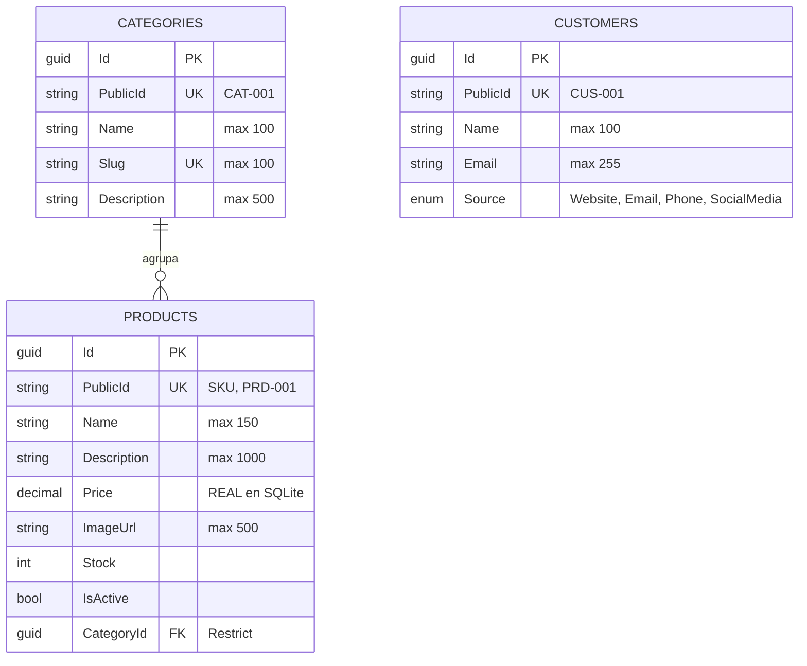

# Modelo de Datos — TheOffice

## Visión general

Tres tablas, un solo `DbContext`. `Categories` agrupa `Products` (1—N, con borrado restringido);
`Customers` está aislada y existe como base para el futuro carrito y los pedidos, sin FK hacia
las otras dos todavía.

Todas las entidades tienen **dos identificadores**: un `Id` (`Guid`) privado que nunca sale de la
base de datos, y un `PublicId` (`string`) que es el único que viaja por la API — `PRD-001`,
`CAT-001`, `CUS-001`. `PublicId` tiene índice único en las tres tablas.

Ojo con el desdoblamiento de modelos: `TheOffice.Domain/Entities/*` son objetos de negocio planos y
`TheOffice.Persistence/Models/*` son las formas mapeadas por EF Core (heredan de `BaseModel`, que
aporta el `Id` con `Guid.NewGuid()` por defecto). Son clases distintas con el mismo nombre; la
traducción vive en `Persistence/Mappers/*`. Detalle en [la guía .NET](./dotnet.md).

## Herramienta de migraciones

- **Herramienta:** migraciones de EF Core 10.0.10, proveedor SQLite.
- **Ubicación:** `src/Infrastructure/TheOffice.Persistence/Migrations/`
- **Flujo:**
  - En `Development` la app corre `context.Database.Migrate()` al arrancar (`Program.cs`), así que
    un clone limpio no necesita preparar nada. En cualquier otro entorno hay que aplicarlas por fuera.
  - Para crearlas a mano, desde `src/` (requiere `dotnet tool install --global dotnet-ef`):
    ```bash
    dotnet ef migrations add <Nombre> -p Infrastructure/TheOffice.Persistence -s Presentation/TheOffice.Api
    dotnet ef database update -p Infrastructure/TheOffice.Persistence -s Presentation/TheOffice.Api
    ```
  - Hoy existe una sola migración: `20260806164911_InitialCreate`.
  - **Los datos semilla son parte del modelo**: los seeders usan `HasData` dentro de
    `OnModelCreating`. Cambiar un seeder **exige generar una migración nueva**, o la BD queda
    desincronizada.
- **Archivo local:** `theoffice.db` se crea en la carpeta de ejecución y está en `.gitignore`.

## Diagrama entidad-relación



## Tablas

### Core

| Tabla | Propósito | Relaciones clave |
|---|---|---|
| `Categories` | Agrupa el catálogo y alimenta la navegación. El `Slug` es la clave de filtrado que usa la API, no el `PublicId`. | 1—N hacia `Products` |
| `Products` | El catálogo. `IsActive` distingue publicado de retirado. | FK `CategoryId` → `Categories`, `DeleteBehavior.Restrict` |
| `Customers` | Registro de clientes; base del futuro carrito y pedidos. | Ninguna todavía |

No hay tablas de referencia ni de lookup: `CustomerSource` es un enum de .NET persistido como
`INTEGER`, no una tabla.

### Detalles que sorprenden

- **`Price` se almacena como `REAL`, no como texto ni decimal.** SQLite guarda `decimal` como TEXT
  y no puede compararlo ni ordenarlo en SQL, así que `TheOfficeDbContext` lo configura con
  `HasConversion<double>()`. Es un workaround **solo de SQLite**: se retira al migrar a SQL Server,
  y no debe copiarse a otros campos decimales sin razón. Ver
  [ADR-0002](./adrs/adr-0002-persistencia-sqlite-ef-core.md).
- **El borrado de categorías está restringido** (`DeleteBehavior.Restrict`): no se puede borrar una
  categoría con productos asociados.
- **El filtro `IsActive` no es un query filter global.** Es un `.Where(x => x.IsActive)` explícito
  dentro de `ProductRepository.GetPaged`, así que **solo aplica al listado paginado**;
  `GET /api/v1/products/{publicId}` sí devuelve productos inactivos.
- **Datos semilla:** 4 categorías, 16 productos y 3 clientes, con GUIDs fijos y hardcodeados en
  `Seeders/`.
- **`Price` no lleva moneda.** Es un `decimal` sin campo `Currency` acompañante, así que la
  moneda es implícita y el modelo no la representa.
  <!-- TODO: verificar — las magnitudes de los seeders sugieren COP, pero no está declarado en
       ninguna parte. Definirlo antes de que existan pedidos o facturación. -->

## Seguridad a nivel de fila / control de acceso

**No hay ninguno.** Sin RLS, sin multi-tenancy, sin filtros por tenant y sin autenticación: todas
las filas son visibles para cualquier consumidor de la API. El único control es que los
identificadores internos (`Id`) nunca se exponen — las rutas usan `PublicId`.

Cuando se agregue autenticación (punto 4 del roadmap), este es el lugar donde documentar el
invariante correspondiente.

## Docs relacionados

- [Arquitectura](./architecture.md) · [Guía de la solución .NET](./dotnet.md) · [Decisiones](./adrs/)
- [`README.md`](../README.md) — el mismo modelo, en el contexto del producto.
