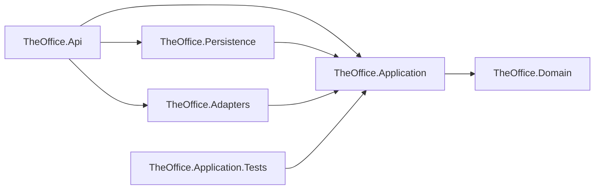

# Guía de la Solución .NET — TheOffice

Contexto .NET profundo para agentes de IA. Para el panorama general ve
[arquitectura](./architecture.md), [modelo de datos](./data-model.md) e
[infraestructura](./infrastructure.md).

## 1. Solución y proyectos

- **Archivo de solución:** `src/TheOffice.sln` (formato clásico `.sln`, no `.slnx`)

| Proyecto | Tipo | TFM | Propósito |
|---|---|---|---|
| `TheOffice.Domain` | Class Library | `net10.0` | Entidades de negocio, enums, `Result`/`Result<T>`, constantes. Sin dependencias. |
| `TheOffice.Application` | Class Library | `net10.0` | Servicios, DTOs, mappers Dominio↔DTO y los puertos que implementa Infrastructure. |
| `TheOffice.Persistence` | Class Library | `net10.0` | EF Core: `DbContext`, modelos propios, repositorios, migraciones, seeders. |
| `TheOffice.Adapters` | Class Library | `net10.0` | Adaptadores hacia servicios externos (hoy solo notificaciones por consola). |
| `TheOffice.Api` | Web API (`Microsoft.NET.Sdk.Web`) | `net10.0` | Controllers, CORS, versionado de API, OpenAPI/Scalar, composition root. |
| `TheOffice.Application.Tests` | Test (xUnit v3) | `net10.0` | Pruebas unitarias de la capa Application. |

El proyecto de pruebas vive en `tests/`, **fuera** del árbol físico de `src/`, pero está registrado
en `src/TheOffice.sln` bajo una carpeta de solución `Tests` con ruta relativa `..\tests\...`.

**Referencias entre proyectos** (las dependencias apuntan hacia adentro):



`TheOffice.Api` referencia a Persistence y Adapters **solo para cablear la DI** en `Program.cs`;
no usa sus tipos en los controllers.

## 2. Target frameworks y lenguaje

- **Target framework:** `net10.0` en los seis proyectos. Sin multi-targeting, sin discrepancias.
- **Postura del lenguaje:** `<Nullable>enable</Nullable>`, `<ImplicitUsings>enable</ImplicitUsings>`
  y `<LangVersion>latest</LangVersion>`, ahora centralizados en `Directory.Build.props` (los
  proyectos siguen declarando los dos primeros por su cuenta; es redundante, no contradictorio).
- **SDK fijado:** `global.json` fija `10.0.100` con `rollForward: latestFeature`. Cualquier SDK
  10.0.x igual o superior sirve; uno de .NET 9 u 11 no. Se eligió la banda más baja de 10.0 a
  propósito: fijar la versión instalada en una máquina deja fuera a quien tenga una banda anterior,
  y un pin que estorba se borra.
- **Props de build compartidas:** `Directory.Build.props` en la raíz aplica a los siete proyectos.
  Ahí viven la postura del lenguaje, los analizadores, `TreatWarningsAsErrors`,
  `EnforceCodeStyleInBuild`, la auditoría de NuGet y `RestorePackagesWithLockFile` (ver §8).
  **No declara `<TargetFramework>`**: MSBuild importa ese archivo antes del cuerpo de cada
  `.csproj`, así que un proyecto que declare el suyo lo pisa — y los siete lo declaran. Ponerlo ahí
  sería una propiedad inerte que aparenta centralizar algo que no centraliza.
- **Idioms de C# 14:** el repo **no** usa `field`, bloques `extension`, `?.=` ni operadores
  definidos por el usuario. Usa properties auto-implementadas y constructores explícitos.
  Sigue ese estilo; no "modernices" por modernizar.

## 3. Gestión de paquetes y dependencias

- **Gestión de versiones:** **centralizada**. Todas las versiones viven en
  `Directory.Packages.props` en la raíz, y un `<PackageReference>` **nunca lleva** atributo
  `Version` — solo `Include`. Para subir un paquete se edita el `<PackageVersion>` de ese archivo.
  `CentralPackageVersionOverrideEnabled` está en `false`: un proyecto no puede volver a su propia
  versión con `VersionOverride` sin que la restauración falle con `NU1013` y lo nombre. Es
  deliberado — la deriva silenciosa entre proyectos es exactamente lo que este archivo evita.
- **Lockfiles:** cada proyecto tiene un `packages.lock.json` versionado, generado por
  `RestorePackagesWithLockFile`. Congelan el árbol resuelto, transitivas incluidas. **Cambiar una
  versión exige `dotnet restore` en el mismo commit**: CI restaura en modo bloqueado y falla con
  `NU1004` si el lock y el proyecto no coinciden.
- **Feeds:** no hay `nuget.config`; solo nuget.org.
- **Herramientas locales:** no hay `.config/dotnet-tools.json`, así que `dotnet tool restore` no
  aplica y `dotnet ef` debe instalarse como herramienta global
  (`dotnet tool install --global dotnet-ef`). No está garantizada en una máquina recién clonada.

| Paquete | Versión | Rol |
|---|---|---|
| `Microsoft.EntityFrameworkCore` | 10.0.10 | ORM |
| `Microsoft.EntityFrameworkCore.Sqlite` | 10.0.10 | Proveedor SQLite |
| `Microsoft.EntityFrameworkCore.Design` | 10.0.10 | Tiempo de diseño para `dotnet ef` (solo en `TheOffice.Api`, `PrivateAssets=all`) |
| `SQLitePCLRaw.bundle_e_sqlite3` | 2.1.12 | **Referencia directa defensiva** — eleva la transitiva 2.1.11 que tiene CVE |
| `Microsoft.AspNetCore.OpenApi` | 10.0.10 | Generación de OpenAPI |
| `Microsoft.OpenApi` | 2.11.0 | **Referencia directa defensiva** — eleva la transitiva 2.0.0 que tiene CVE |
| `Asp.Versioning.Mvc` · `.ApiExplorer` · `.OpenApi` | 10.2.0 | Versionado de API por segmento de URL |
| `Scalar.AspNetCore` | 2.16.17 | UI interactiva de documentación |
| `Microsoft.Extensions.DependencyInjection.Abstractions` | 10.0.10 | Extensiones `AddXxx()` por capa |
| `xunit.v3.mtp-v2` | 3.2.2 | Framework de pruebas |
| `NSubstitute` | 6.0.0 | Dobles de prueba |

- **Salud de dependencias:** dos paquetes (`SQLitePCLRaw.bundle_e_sqlite3` y `Microsoft.OpenApi`)
  existen **únicamente** para elevar versiones transitivas vulnerables; los `.csproj` lo dicen en
  comentarios. **No los elimines** por parecer no usados — quitarlos reintroduce el CVE.
  La auditoría de NuGet (`NuGetAudit`, nivel `low`, modo `all`) ya está activa en
  `Directory.Build.props` y, con los warnings como errores, un aviso de vulnerabilidad **rompe la
  compilación**. Eso incluye avisos publicados después del último commit: un build que estaba verde
  puede ponerse rojo sin que nadie toque el repo. Es intencional. Para suavizarlo, subir
  `NuGetAuditLevel` o pasar `NuGetAuditMode` a `direct`, dejando la razón escrita ahí mismo.

## 4. Composition root / DI

- **Contenedor:** el integrado de `Microsoft.Extensions.DependencyInjection`.
- **El registro vive en:** `src/Presentation/TheOffice.Api/Program.cs`, que compone tres métodos
  de extensión, uno por capa, cada uno en un `DependencyInjection.cs` en la raíz de su proyecto:
  - `AddApplication()` → `src/Application/TheOffice.Application/DependencyInjection.cs`
  - `AddAdapters()` → `src/Infrastructure/TheOffice.Adapters/DependencyInjection.cs`
  - `AddPersistence(IConfiguration)` → `src/Infrastructure/TheOffice.Persistence/DependencyInjection.cs`
- **Convenciones / lifetimes:** todo es `Scoped` — el `DbContext`, los tres repositorios y los tres
  servicios. **Los servicios de Application se registran como clases concretas**
  (`AddScoped<ProductService>()`), no contra una interfaz; los controllers inyectan el tipo
  concreto. Los repositorios y el adaptador sí van contra interfaz. Al agregar una capacidad nueva,
  registra en el `DependencyInjection.cs` de su capa, no en `Program.cs`.

## 5. Acceso a datos (EF Core)

- **Proveedor:** SQLite (EF Core 10.0.10), vía `UseSqlite(...)` con la cadena
  `ConnectionStrings:DefaultConnection`.
- **DbContext:** `TheOfficeDbContext` en `src/Infrastructure/TheOffice.Persistence/TheOfficeDbContext.cs`
  (~50 líneas — no es un punto caliente). Expone `Customers`, `Categories`, `Products`.
- **Configuración del modelo:** **híbrida**. Las restricciones de columna (`[Required]`,
  `[StringLength]`, `[Table]`, `[Index]`) son data annotations sobre
  `Persistence/Models/*.cs`; la relación Product→Category y la conversión de `Price` son Fluent API
  en `OnModelCreating`.
- **Query filters:** no hay filtros globales ni con nombre. El filtro `IsActive` del catálogo es un
  `.Where(x => x.IsActive)` explícito dentro de `ProductRepository.GetPaged`, **no** un query
  filter — es decir, `GetByPublicId` sí devuelve productos inactivos.
- **Conversión de `Price`:** `HasConversion<double>()` porque SQLite guarda `decimal` como TEXT y no
  soporta comparar ni ordenar en SQL. Es un workaround **específico de SQLite**: se retira al migrar
  a SQL Server, y no debe replicarse en otros campos decimales sin razón. Ver
  [ADR-0002](./adrs/adr-0002-persistencia-sqlite-ef-core.md).
- **Migraciones:** `src/Infrastructure/TheOffice.Persistence/Migrations/` (una sola,
  `InitialCreate`). Se aplican con `context.Database.Migrate()` al arrancar **solo en
  `Development`** (`Program.cs`); en cualquier otro entorno hay que aplicarlas por fuera.
  Los datos semilla van por `HasData` dentro de `OnModelCreating`, así que **tocar un seeder exige
  generar una migración nueva**. Ver [modelo de datos](./data-model.md).

## 6. Configuración y secretos

- **Capas de configuración:** `appsettings.json` → `appsettings.Development.json` → variables de
  entorno (el default del host). No hay `<UserSecretsId>`, ni `.env`, ni Key Vault.
- **Estrategia de secretos:** hoy no hay secretos. La única cadena de conexión es
  `Data Source=theoffice.db`, un archivo SQLite local que está en `.gitignore`. **En producción los
  secretos vendrán de variables de entorno** — `ConnectionStrings__DefaultConnection` sobreescribe
  el valor de `appsettings.json` sin tocar el archivo.
- **CORS:** `Cors:AllowedOrigins` es un arreglo vacío en ambos `appsettings`. Cuando está vacío,
  `Program.cs` cae en `AllowAnyOrigin()`. Es aceptable para desarrollo, pero **desplegar con el
  arreglo vacío deja la API abierta a cualquier origen**.

## 7. Build, ejecución y pruebas

Todo pasa por el `Makefile` en la raíz. La lista completa de objetivos está en
[`AGENTS.md`](../AGENTS.md); `make help` la imprime.

```bash
# desde la raíz del repo
make check                                        # lint + build + test
make run                                          # http://localhost:5226 · docs en /scalar

# migraciones, desde src/ (requiere: dotnet tool install --global dotnet-ef)
dotnet ef migrations add <Nombre> -p Infrastructure/TheOffice.Persistence -s Presentation/TheOffice.Api
dotnet ef database update -p Infrastructure/TheOffice.Persistence -s Presentation/TheOffice.Api
```

- **Runner de pruebas:** **Microsoft.Testing.Platform**, seleccionado por `global.json` en la raíz
  del repo. Lo exige `xunit.v3.mtp-v2`. **No borres `global.json`** ni asumas argumentos de VSTest
  (`--filter` de VSTest, `--logger trx`, etc.): MTP acepta otro juego de flags. Para escribir un TRX,
  este runner usa `--report-xunit-trx` — no `--logger trx` ni `--report-trx`, que rechaza. El
  `Makefile` ya lo pasa.
- **Framework de pruebas:** xUnit v3 (`xunit.v3.mtp-v2` 3.2.2). El proyecto es `<OutputType>Exe`,
  como exige MTP.
- **Librerías de apoyo:** NSubstitute 6.0.0 para dobles. Las aserciones son las nativas de xUnit
  (`Assert`), sin FluentAssertions. **No hay** cobertura, snapshot testing, `WebApplicationFactory`
  ni Testcontainers.
- **Organización de las pruebas:** un proyecto por proyecto bajo prueba, con archivos que espejan
  el layout del código fuente (`Services/ProductServiceTests.cs`). Los nombres de prueba van en
  inglés, con el patrón `Method_Scenario_ExpectedResult` (los actuales siguen en español). Como los DTOs de respuesta son
  `record`, `Assert.Equal` compara objetos completos de forma estructural.
- **`tests/TheOffice.ArchitectureTests`** es la excepción: no prueba una capa sino la relación
  entre todas. Usa ArchUnitNET 0.13.4 con la extensión `TngTech.ArchUnitNET.xUnitV3`, que es la que
  corresponde a xUnit v3 sobre MTP. Nueve reglas, detalladas en §8. `make test` lo corre con el
  resto; `make arch` lo corre solo.
- **Cobertura actual:** `ProductService` (11 métodos, 16 casos) más 9 reglas de arquitectura — 25
  pruebas en total. `CategoryService` y `CustomerService` siguen sin pruebas unitarias.

## 8. Puertas de calidad

| Puerta | Estado | Implementada en | Notas |
|---|---|---|---|
| SDK fijado | **presente** | `global.json` | `10.0.100`, `rollForward: latestFeature`. Un SDK que no cumpla hace fallar cualquier comando `dotnet`. |
| Versiones centralizadas + lockfiles | **presente** | `Directory.Packages.props`, `packages.lock.json` | Ver §3. CI restaura en modo bloqueado. |
| Warnings como errores | **presente** | `Directory.Build.props` | Con `EnableNETAnalyzers` y `AnalysisLevel=latest`. Una sola excepción: `CS1591`, documentada en el archivo. |
| `.editorconfig` | **presente** | `.editorconfig` | Indentación de 2 espacios (medida, no supuesta), orden de `using`, namespaces con ámbito de archivo, `_camelCase` en campos privados. `IDE0055` en `error`. |
| Formateador (`dotnet format`) | **presente** | `Makefile` | `make lint` verifica, `make format` corrige. Corre también dentro del build vía `EnforceCodeStyleInBuild`. |
| Arch-linting (ArchUnitNET) | **presente** | `tests/TheOffice.ArchitectureTests` | Nueve reglas; ver abajo. |
| Auditoría de dependencias | **presente** | `Directory.Build.props` | `NuGetAudit` nivel `low`, modo `all`. Rompe el build. `make audit` además lista lo vulnerable sin fallar. |
| Escaneo de secretos | **presente** | `lefthook.yml`, `.github/workflows/ci.yml` | `gitleaks protect` en cada commit, `gitleaks detect` sobre la historia en CI. |
| Hooks de Git | **presente** | `lefthook.yml` | `make hooks` los instala. Formato y secretos en `pre-commit`, formato del mensaje en `commit-msg`, `make check` en `pre-push`. |
| Integración continua | **presente** | `.github/workflows/ci.yml` | Corre `make ci`. Ver [infraestructura](./infrastructure.md). |

### Reglas de arquitectura verificadas

Todas pasaban contra el código en el momento de escribirlas — una regla que el repo ya viola es
una conversación, no una prueba.

En `LayerDependencyTests`:

1. `Domain` no depende de ninguna otra capa.
2. `Application` no depende de `Persistence`, `Adapters` ni `Api`.
3. `Application` no depende de EF Core.
4. `Domain` no depende de EF Core.
5. `Persistence` y `Adapters` no dependen entre sí.
6. Nadie depende de `Api` — es el punto de entrada, y por tanto una hoja del grafo.

En `ConventionTests`:

7. Las interfaces terminadas en `Repository` viven en `TheOffice.Application.Interfaces`.
8. Las interfaces terminadas en `Adapter` viven en `TheOffice.Application.Interfaces`.
9. Solo `Adapters` escribe a la consola.

Reglas **no** escritas, por no ser verificables con esta herramienta: "los controllers no
contienen lógica de negocio", "no se lanzan excepciones para control de flujo" y "las rutas
exponen `PublicId`, nunca el `Id` interno". Las tres siguen siendo disciplina y revisión humana;
están en [`AGENTS.md`](../AGENTS.md) y en [arquitectura](./architecture.md).

## 9. Superficie de API

- **Forma de la API:** **controllers** (`[ApiController]` + `ControllerBase`), no minimal APIs.
  Tres controllers en `src/Presentation/TheOffice.Api/Controllers/`, uno por agregado. Todas las
  rutas están versionadas: `[Route("api/v{version:apiVersion}/...")]` con
  `UrlSegmentApiVersionReader`; hoy solo existe la versión `1.0`.
- **Validación:** no hay librería de validación ni `DataAnnotations` en los DTOs de entrada.
  Las reglas viven a mano en los servicios de Application: `Enum.TryParse` para
  `CustomerSource`, resolución de la categoría por slug antes de crear un producto, y
  `Math.Clamp(pageSize, 1, 50)` para la paginación.
- **Contrato de respuesta:** los controllers devuelven `IActionResult` sin
  `[ProducesResponseType]`, así que el documento OpenAPI no describe los tipos de respuesta.
  El patrón es: `Result.IsSuccess == false` → `BadRequest(result.Error)`; `null` → `NotFound()`;
  éxito → `Ok(...)`.
- **OpenAPI:** `Microsoft.AspNetCore.OpenApi` integrado (`AddOpenApi()` + `MapOpenApi()`), con
  `WithDocumentPerVersion()` de `Asp.Versioning.OpenApi` y **Scalar** como UI en `/scalar`.
  Dos detalles del .NET 10 que importan: el generador emite **OpenAPI 3.1 por defecto** (los tipos
  nullable se rinden como arreglo de tipos con `null`, no como `nullable: true`), y
  **`WithOpenApi()` está deprecado** — no lo agregues a endpoints nuevos.
  OpenAPI y Scalar **solo se montan en `Development`**.
- **Identidad:** **ninguna**. No hay autenticación ni autorización; los endpoints de escritura
  (`POST /products`, `POST /customers`) están abiertos. Es deliberado (punto 4 del roadmap).
- **CORS:** una sola política, `TheOfficeFrontends`, aplicada globalmente. Ver §6.

## 10. Despliegue y empaquetado

- **Forma del empaquetado:** **ninguna definida todavía.** No hay `Dockerfile`, ni `compose*.yml`,
  ni propiedades `<EnableSdkContainerSupport>` / `<ContainerRepository>`, ni IaC. Hoy la app solo
  se ejecuta con `dotnet run`.
  Nota para cuando se defina: el SDK puede construir imágenes **sin Dockerfile** con
  `dotnet publish /t:PublishContainer`.
- **AOT / trimming / archivo único:** nada activo. No hay `<PublishAot>`, `<PublishTrimmed>` ni
  `<PublishSingleFile>`, así que **no hay restricciones sobre reflexión ni serialización JSON**.
- **Ubicación de salida:** el default (`bin/` y `obj/` por proyecto). No se configura
  `<ArtifactsPath>`.

Ver [infraestructura](./infrastructure.md) para el destino de despliegue y la ruta a producción.

## 11. Preocupaciones transversales

Prácticamente ausentes, y conviene no asumir lo contrario:

- **Observabilidad:** solo el logging por defecto de `Microsoft.Extensions.Logging`, configurado en
  `appsettings.json`. Sin OpenTelemetry, sin health checks, sin Serilog/NLog.
- **Resiliencia:** nada. Sin Polly ni `Microsoft.Extensions.Http.Resilience`. Tampoco hay
  `HttpClient` saliente que las necesite.
- **Manejo de errores:** no hay middleware de excepciones ni `ProblemDetails`. Los errores de
  negocio viajan por `Result`; una excepción no capturada sale como el 500 por defecto de Kestrel.
- **IA:** nada. Sin `Microsoft.Extensions.AI`, Semantic Kernel ni MCP.
- **Aspire:** no se usa. La aplicación se ejecuta con `dotnet run --project`.

## 12. Trampas / puntos calientes

- **Ningún método async propaga `CancellationToken`** — cero ocurrencias en todo `src/`. Sigue el
  patrón existente; no empieces a hilarlo en un solo método.
- **Los métodos async no llevan sufijo `Async`** (`GetPaged`, no `GetPagedAsync`). Es deliberado.
- **Dos jerarquías de modelos separadas.** `Domain/Entities/Product.cs` y
  `Persistence/Models/Product.cs` son clases distintas con el mismo nombre. Los repositorios las
  desambiguan con alias de using (`using DomainEntities = TheOffice.Domain.Entities;`). Nunca pases
  una donde se espera la otra; la traducción vive en `Persistence/Mappers/*`.
- **`ProductController` no es testeable unitariamente**: depende de la clase concreta
  `ProductService`, cuyos métodos no son `virtual`. Cubrirlo exige extraer un `IProductService` o
  pruebas de integración con `WebApplicationFactory` — que a su vez necesitarían
  `public partial class Program` en `Program.cs`, hoy ausente.
- **El comportamiento del repositorio no está cubierto por pruebas.** El filtro `IsActive`, el trim
  del slug, el `LIKE` de la búsqueda y el ordenamiento viven en `ProductRepository` y solo se
  alcanzan con pruebas de integración contra SQLite in-memory (ojo con el `HasConversion<double>()`
  de `Price` al montarlas).
- **Los repositorios sí capturan excepciones**, pero solo para convertirlas en `Result.Failure`
  en las rutas de escritura (`try/catch (Exception ex)` en `Create`). Ese es el único lugar donde
  se atrapan excepciones; en servicios y controllers no se usa `try/catch` para control de flujo.
- **Los repositorios mutan la entidad de dominio tras guardar**: `Create` asigna
  `product.Id = modelProduct.Id` de vuelta sobre el objeto recibido. Las entidades de dominio son
  clases mutables con setters públicos, no records.
- **`TheOfficeDbContext` recibe `DbContextOptions` no genérico**, no `DbContextOptions<TheOfficeDbContext>`.
  Funciona con un solo contexto; agregar un segundo `DbContext` rompería la resolución de DI.
- **`GlobalConstants.TheOfficeDbContext` está sin usar** — cero referencias en el repo. No asumas
  que cablea algo.
- **`ConsoleNotificationAdapter` es un stub**: hace `Console.WriteLine` dentro de un `Task.Run`.
  No hay notificaciones reales. La regla de arquitectura "solo `Adapters` escribe a la consola"
  depende de que siga siendo el único: si se agrega otro adaptador que escriba a consola, seguirá
  pasando; si alguien escribe a consola desde otra capa, `make test` se pone rojo.
- **`GenerateDocumentationFile` está activo, y `CS1591` silenciado.** La propiedad no está para
  publicar documentación de API: hace falta para que `IDE0005` (usings innecesarios) se reporte en
  un build de línea de comandos. El efecto colateral es que Roslyn exige comentarios XML en cada
  tipo público, lo que aquí no aporta nada — de ahí el `NoWarn`, con su razón escrita en
  `Directory.Build.props`. Revisar si algún proyecto llega a empaquetarse como librería NuGet.
- **En `.editorconfig`, el orden de las secciones es semántico.** El archivo no tiene más alcance
  que el último encabezado leído, así que una regla de C# escrita después de
  `[**/Migrations/*.cs]` aplica solo a los archivos generados — que además están excluidos por
  `generated_code = true`. Queda inerte y **nada lo reporta**. Todas las reglas de C# van en
  `[*.{cs,csx}]`, y las secciones angostas al final del archivo.

## Docs relacionados

- [Arquitectura](./architecture.md) · [Modelo de datos](./data-model.md) · [Infraestructura](./infrastructure.md) · [Decisiones](./adrs/)
- [`README.md`](../README.md) — doc preexistente del repo: endpoints, stack y las decisiones de implementación originales.
